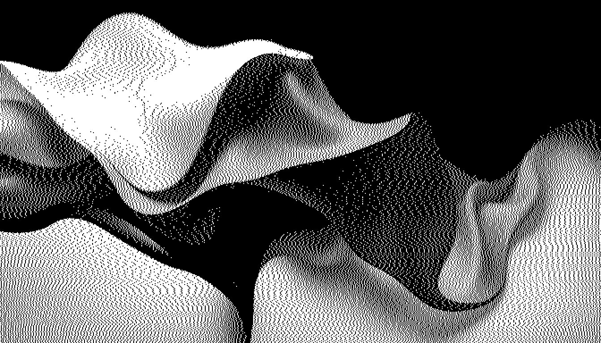

## Introduction 

> named after **Muad'Dib**, a wise desert mouse. In Fremen culture it means _**"the one who points the way"**_

Highly experimental automation software for declaring pipeline of setup of programs of daily usage and its dotfiles at once.  
It supports most of the features that are wanted during creating such flow for reproductible developer's environment.

Some of them are:
1. Cloning git repositories (via `clone-repository` tool)
2. Executing any shell commands (via `execute-bash-command` tool)
3. Programatically matching and responding to interactive Y/n prompts (via `execute-bash-command` tool and `interactive-prompts` set)
4. Installing global npm/yarn/pnpm/bun packages (via `js-global-install` tool)
5. Installing manpages (via `install-manpages` tool)
6. Installing binaries to system PATH. (via `install-binary` tool)

It also provides pipeline utilities such as safe way to clean up build artifacts from the system.

### Future

As previously mentioned the project is in highly experimental stage (not even pre-release). There is no versioning and breaking changes are being introduced every commit. Beware of the rapid-changing nature of it. If you want to use it despite all that I'm more than happy to hear any feedback or suggestions.

Stable release is expected anytime soon, when this happens the README will drastically change.

### Example element

Builds `bat` from source, copies the predefined configuration (dotfiles directory) and rebuilds the `bat` cache. After everything installs the manpages and safely moves the temporary build artifacts to system trash. 

```yml
pipeline:
  # Clone the remote repository from `main`
  - tool: clone-repository
    with:
      url: https://github.com/sharkdp/bat.git
      branch: master 
      output-assign: $>{{ ctx.batSourcePath }}

  # Build and install the binary using cargo
  - tool: execute-bash-command
    with:
      command: "cargo install --path . --locked"
      working-directory: ${{ ctx.batSourcePath }}
      quiet: true

  # Copy the dotfiles into system's valid path
  - tool: execute-bash-command
    with:
      command: "cp -fR .config/bat/ ~/.config/bat/"
      working-directory: ${{ ctx.storageDirectory }}
      quiet: true

  # Rebuild the bat's cache in order to see the themes from previously copied configuration
  - tool: execute-bash-command
    with:
      command: "./bat cache --build"
      working-directory: ${{ ctx.batSourcePath }}/target/release/
      quiet: true

  # Install manpages manually. The cargo install step does not handle that.
  - tool: install-manpages
    with:
      source-directory: ${{ ctx.batSourcePath }}/target/release/build/
      update-database: true

  # Safely clean up the local repository and obsolete build artifacts (move to system trash)
  - tool: safe-cleanup
    with:
      paths:
        - ${{ ctx.batSourcePath }}

```

## License

MIT
